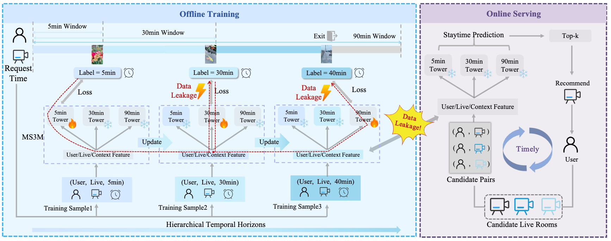

# DAST

[](https://doi.org/10.5281/zenodo.20506711)

<a href="https://doi.org/10.5281/zenodo.20506711"></a>




## Overview

We reveal that multi-window streaming in live-streaming recommendation inherently introduces data leakage issue (i.e., short-window training updates 
embeddings that long-window serving-time prediction cannot access). This causes a training–serving mismatch and significantly degrades long-horizon 
staytime prediction. To better analyze this problem, we construct the first benchmark for data leakage detection in live-streaming recommendation. We 
reveal that this issue mainly stems from shared bottom embeddings rather than task-specific heads, and identify a cutoff time beyond which the 
timeliness gains are outweighed by leakage-induced losses. In light of this analysis, we propose a simple but effective approach, called **DAST**, 
which decouples embeddings across different temporal windows to blocks leakage paths while preserving the advantages of multi-window supervision. 
Experiments demonstrate consistent improvements on staytime prediction, and our method can be seamlessly integrated into existing frameworks, making 
it a general and model-agnostic solution for leakage-aware live-streaming recommendation.

## Table of Contents

- [Repository Structure](#repository-structure)
- [Dataset Preparation](#dataset-preparation)
- [Training and Reproduction](#training-and-reproduction)
- [Implemented Baselines](#implemented-baselines)

## Repository Structure

```text
DAST_kdd26/
├── dataset/
│   ├── KuaiLive/
│   └── SegMM/
├── model/
│   ├── defer.py
│   ├── es_dfm.py
│   ├── orm_3window.py
│   ├── orm_3window_delayed3.py
│   ├── orm_2window_30s_3600s.py
│   ├── orm_model_5min_stream.py
│   ├── orm_model_30min_stream.py
│   ├── orm_model_90min_stream.py
│   ├── layer_utils.py
│   ├── model_factory.py
│   └── window_utils.py
├── utils/
│   ├── data_utils.py
│   ├── dataset_config.py
│   ├── memory_bank.py
│   ├── metric_utils.py
│   ├── profile_utils.py
│   ├── save_res.py
│   ├── set_seed.py
│   ├── streaming_utils.py
│   └── xauc.py
├── train_model_streaming.py
├── streaming_full_window_kuailive.sh
└── streaming_full_window_segmm.sh
```


## Dataset Preparation

### 1) KuaiLive

1. Download KuaiLive from: <https://imgkkk574.github.io/KuaiLive/>
2. Put raw files under `dataset/KuaiLive/`
3. Run preprocessing:

```bash
cd dataset/KuaiLive
python preprocess_kuailive_wt.py
```

4. Generate the required data stream for the target model:

```bash
# Direct Training (5min)
python create_single_window_stream.py --window_min 5

# Direct Training (30min)
python create_single_window_stream.py --window_min 30

# Direct Training (90min)
python create_single_window_stream.py --window_min 90

# 5min-30min ES-DFM
python create_5min_30min_conditional_two_window_stream.py

# 5min-90min ES-DFM
python create_5min_90min_conditional_two_window_stream.py

# 5min-30min DEFER
python create_5min_30min_two_window_stream.py

# 5min-90min DEFER
python create_5min_90min_two_window_stream.py

# Sliver
python create_30s_60min_two_window_stream.py

# MS3M and DAST
python split_multi_window.py
```

### 2) SegMM

1. Download SegMM from: <https://github.com/hezy18/SegMMInterest/blob/main/SegMM.md>
2. Put `SegMM_inter.csv` under `dataset/SegMM/`
3. Run preprocessing:

```bash
cd dataset/SegMM
python preprocess_segmm_wt.py
```

4. Generate the required data stream for the target model:

```bash
# Direct Training (60s)
python create_single_window_stream.py --window_sec 60

# Direct Training (120s)
python create_single_window_stream.py --window_sec 120

# Direct Training (240s)
python create_single_window_stream.py --window_sec 240

# 60s-120s ES-DFM
python create_60s_120s_conditional_two_window_stream.py

# 60s-240s ES-DFM
python create_60s_240s_conditional_two_window_stream.py

# 60s-120s DEFER
python create_60s_120s_two_window_stream.py

# 60s-240s DEFER
python create_60s_240s_two_window_stream.py

# Sliver
python create_30s_180s_two_window_stream.py

# MS3M and DAST
python split_multi_window.py
```

## Training and Reproduction

Use the provided scripts to reproduce experiments:

```bash
bash streaming_full_window_kuailive.sh
bash streaming_full_window_segmm.sh
```

## Implemented Baselines

The run scripts call `train_model_streaming.py` with the following `--model_name` values:
- Direct Training (5min): `ORM5_STREAM`
- Direct Training (30min): `ORM30_STREAM`
- Direct Training (90min): `ORM90_STREAM`
- 5min-30min ES-DFM: `ES-DFM-5-30`
- 5min-90min ES-DFM: `ES-DFM-5-90`
- 5min-30min DEFER: `DEFER-5-30`
- 5min-90min DEFER: `DEFER-5-90`
- Sliver: `ORM2W_30S_3600S`
- MS3M: `ORM3W`
- DAST: `ORM3W_DELAYED3`


